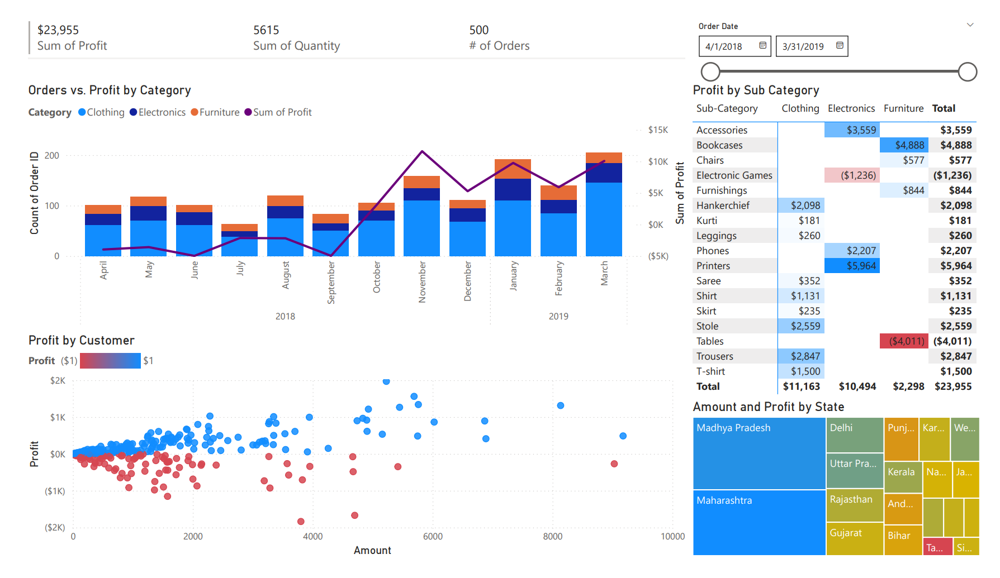
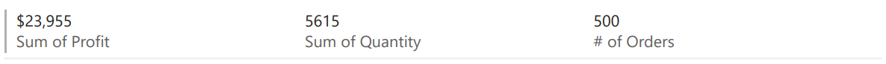
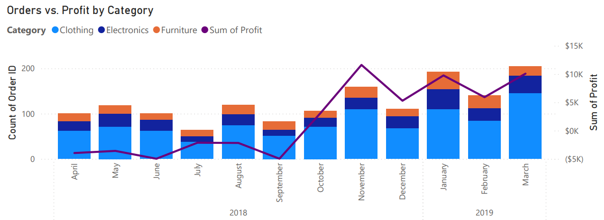
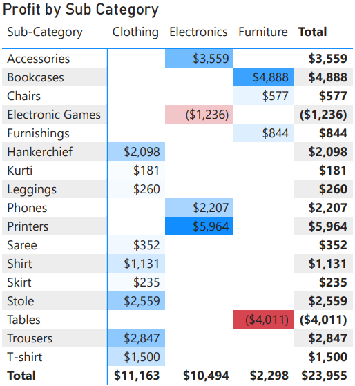
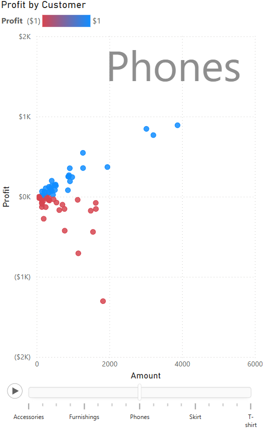
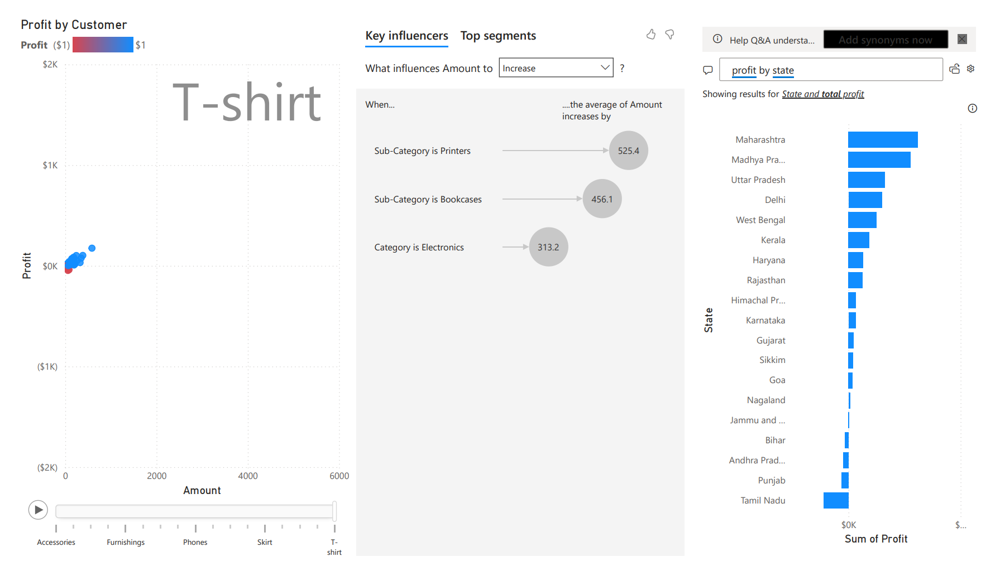

# Power BI Profitability Analysis

This project is a beginner-level business intelligence dashboard built in **Power BI** to analyze sales and profitability data. It was completed as part of a Codecademy data analytics project and represents my first full attempt at creating an end-to-end BI report from raw data to a finished dashboard.

As a Mechanical Engineer by degree and self-taught Software Engineer, this project reflects my growing experience in data analysis and visualization and my interest in using data to solve practical business problems.

---

## Why This Project Was Valuable

Even though the dataset and scenario are fairly simple, the project helped me work through a realistic analytics workflow:

- Turning a business request into clear objectives  
- Cleaning and transforming raw data  
- Building relationships between datasets  
- Designing visuals that communicate information clearly  
- Presenting insights in a way that supports decision making  

Instead of just learning Power BI features in isolation, this project helped me understand how those features fit together to create something useful and practical.

---

## Project Background

In this scenario, the Head of Finance asked for a report to help understand how different products, customers, and regions were performing financially. The main questions to answer were:

- Which areas of the business are most profitable?  
- Are there products or customers that are losing money?  
- How has profit changed over time?  

The final result is an interactive dashboard that makes it easy to explore those questions visually.

---

## Tools and Skills Used

- **Power BI Desktop**  
- Power Query for data cleaning and transformation  
- Basic data modeling and relationships  
- Conditional formatting  
- Interactive dashboards and slicers  

---

## Data Sources

The report uses two CSV files from a publicly available Kaggle dataset:

- **List of Orders.csv** – order and customer details  
- **Order Details.csv** – product, profit, and quantity information  

These were combined inside Power BI to create a simple relational model.

---

## Dashboard Overview

### Main Profit Analysis Dashboard

### KPI Summary

### Profit Trend by Category

### Profit Heatmap by Category and Sub-Category

### Profitability by Customer

---

## Profit Insights Page

A second page was added to allow deeper exploration using built-in Power BI analytics features, such as:

- Play Axis on a scatter chart  
- Key Influencers visual  
- Q&A visual for natural language queries  

---

## What I Learned

Through this project, I gained hands-on experience with:

- Importing and cleaning real datasets  
- Formatting and preparing data for analysis  
- Creating relationships between tables  
- Designing dashboards that tell a clear story  
- Using visuals to highlight meaningful patterns  
- Thinking about data from a business perspective instead of just a technical one  

Most importantly, I learned how to take raw numbers and turn them into insights that are easy for non-technical users to understand.

---

## Key Insights From the Data

While exploring the dashboard, a few practical takeaways became clear:

- Some product sub-categories consistently generate losses  
- A small number of customers negatively impact the overall profit  
- Profitability varies significantly by region  
- High sales volume does not always mean high profit  

These are the types of insights a finance or operations team could use to make real improvements.

---

## How This Project Helps My Future Work

This project is an early step in my transition into more data-focused roles. It helped me build foundational BI skills that I plan to expand on, including:

- More advanced Power BI reports  
- DAX measures and calculations  
- Deeper data modeling  
- Automating data pipelines  
- Combining analytics with software development  

With my background in engineering and software, I’m excited to continue growing at the intersection of data analysis, automation, and decision-making.

---

## How to Use This Project

If you’d like to explore the report yourself:

1. Clone or download this repository  
2. Open `Profitability_Analysis.pbix` in Power BI Desktop  
3. Make sure the CSV files in the `data` folder are accessible  
4. Refresh the data if needed  

---

## Acknowledgements

- Dataset sourced from Kaggle  
- Project concept and instructions from Codecademy  

---

### Final Thoughts

This was a small, entry-level project, but it was an important learning experience. It gave me practical exposure to business intelligence tools and showed me how data analysis can drive better decisions. I plan to continue building more advanced analytics and visualization projects as I develop my skills.
